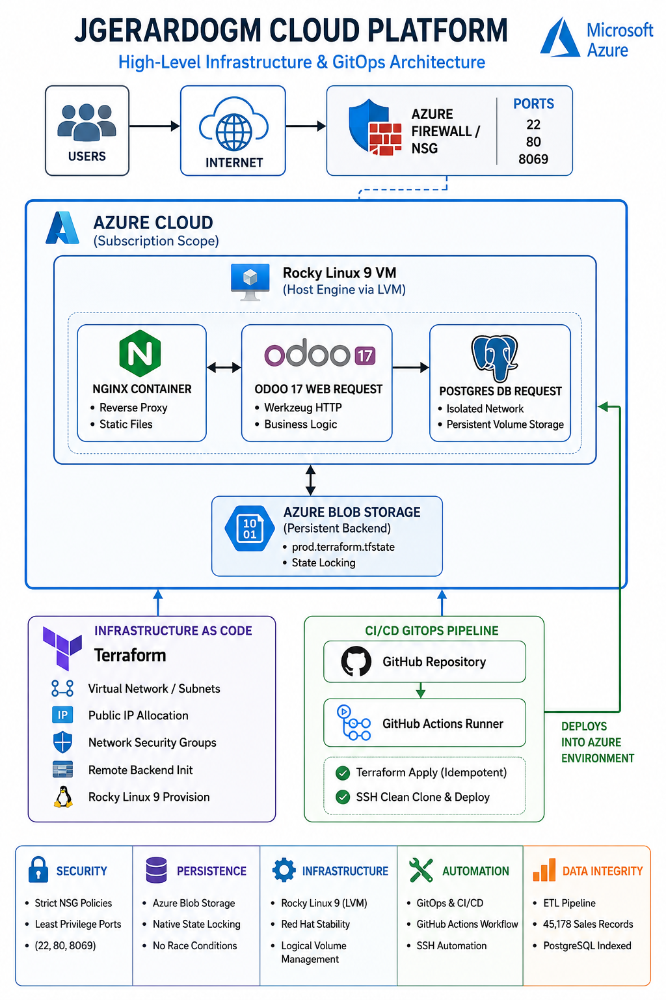

# 🚀 Odoo 17 ERP Cloud Deployment & Legacy Data Migration (45K+ Records)

This repository demonstrates an enterprise-grade, automated deployment of an **Odoo 17 (Community Edition)** ERP ecosystem with extended accounting capabilities (**Odoo Mates**), hosted on Microsoft Azure cloud infrastructure using a robust **GitOps (GitHub Actions + Terraform)** pipeline.

A core component of this project involved designing and executing a critical **ETL (Extract, Transform, Load)** pipeline to clean, map, and successfully migrate a legacy data history of **over 45,000 records** (including users, product templates, and detailed sales history) from an unoptimized MySQL database into a secure, indexed PostgreSQL engine running in the cloud.

---

## 🏗️ System & Infrastructure Architecture

The deployment follows strict Infrastructure as Code (IaC) and GitOps paradigms, ensuring completely immutable, reproducible, and highly secure environments.

    Infrastructure Components (IaC):

    Cloud Provider: Microsoft Azure (Region: denmarkeast).

    Network Security (NSG): Perimeter firewall with zero-trust inbound rules (All traffic blocked except port 22 for administrative SSH, port 80 for standard web proxy, and port 8069 dedicated to Odoo's web interface).

    Terraform State Persistence: Implementation of a native remote Azure Resource Manager (azurerm) Backend utilizing Azure Blob Storage. This approach guarantees state file locks, prevents race conditions, and eliminates state desynchronization across concurrent CI/CD execution environments.

    Base Operating System: Rocky Linux 9 enterprise distribution configured with Logical Volume Management (LVM), providing Red Hat-grade stability and storage scalability.

🐳 Container Stack (Docker Compose)

The entire application environment is containerized and isolated using dedicated internal Docker bridge networks:

    odoo_web (Odoo v17.0): Werkzeug HTTP service exposed externally on port 8069. It uses persistent volume bindings and direct directory mapping (./extra-addons) to enable dynamic community module injection.

    db (PostgreSQL): A hardened relational database engine decoupled from public networking, communicating exclusively through the internal Docker network fabric with Odoo.

    extra-addons (Odoo Mates Accountant): Integration of the community accounting suite to restore advanced features such as double-entry bookkeeping, asset management, budgeting, and detailed financial reporting without requiring an Enterprise license.

📊 Data Migration Strategy (ETL Process)

The primary challenge of this project was executing a zero-downtime data transition from a legacy MySQL schema while maintaining relational integrity and uncorrupted constraints.
Pipeline Pipeline Phases:

    Extraction & Data Cleansing: Handled bad string encodings, converted date strings to uniform ISO formats, purged orphan rows, and optimized foreign key indexes directly on the source MySQL engine.

    Data Schema Mapping: Transformed flat, legacy relational tables into structured JSON/CSV schemas matching the strict Odoo 17 ORM objects (res.users, product.template, and sale.order).

    Bulk Carga & Verification: Migrated and verified:

        Users and Customers: Verified access groups, profiles, and relational parameters.

        Product Templates: Unified base items inventory catalogue.

        Sales History: 45,178 transaction records accurately processed, ledger-balanced, and indexed into the PostgreSQL production engine. All historical data automatically feeds into the Odoo Mates real-time accounting dashboards.

🛠️ CI/CD Automation (GitHub Actions)

The workflow defined in .github/workflows/deploy.yml completely automates infrastructure management and continuous deployment on every push to the main branch through two sequential stages:

    Infrastructure Stage (Terraform): Validates syntax, connects securely to the remote Azure Storage backend, automatically auto-imports pre-existing asset scopes if required, and executes an idempotent deployment plan.

    Deploy & Hardening Stage (SSH): Spawns an isolated secure Go-based runner environment, authenticates via encrypted private keys stored in GitHub Secrets, runs a pristine repository fetch on the target server, updates Linux dependencies, configures proper non-root user permissions for the Docker socket (docker.sock), and re-initializes the container stack via docker compose up -d --build.

🚀 Getting Started
Prerequisites

    Terraform >= 1.7.0

    Azure CLI configured (az login)

    GitHub Repository Secrets configured (AZURE_CREDENTIALS, SSH_PRIVATE_KEY, AZURE_SUBSCRIPTION_ID)

Manual Deployment Bootstrap

    Provision the Remote State Locker in Azure via CLI:
    Bash

    az group create --name rg-odoo-production --location denmarkeast
    az storage account create --name tfstateodoo45k --resource-group rg-odoo-production --sku Standard_LRS --encryption-services blob
    az storage container create --name tfstate --account-name tfstateodoo45k

    Initialize and Apply via Local Development Environment:
    Bash

    cd terraform
    terraform init
    terraform apply -auto-approve

    Verify Environment Infrastructure Services:
    Bash

    ssh -i ~/.ssh/id_azure_prod azureuser@<YOUR_VM_PUBLIC_IP>
    docker ps

Developed and Maintained by Juan Gerardo Gutiérrez Muñoz - Senior Linux Systems Administrator & DevOps Professional.
